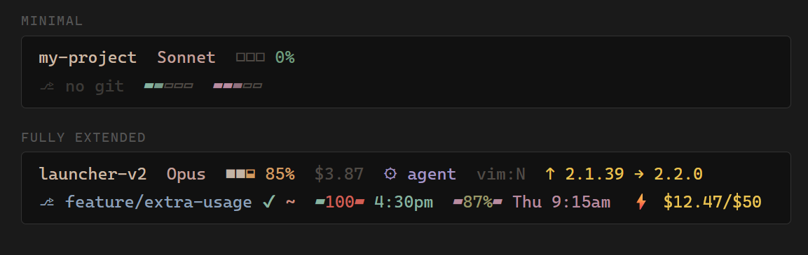

# Claude Tools

Custom tools for [Claude Code](https://claude.ai/claude-code).

**[Live Preview](https://gruku.github.io/claude-tools/)**

## Statusline

Pastel statusline for Claude Code with rate limit bars, git status, context usage, update notifications, and session cost tracking.

**[Live Preview](https://gruku.github.io/claude-tools/statusline/)**

**Features:**
- Pastel color palette with gradient limit bars (green → red)
- Git branch, dirty/staged indicators
- 5-hour and 7-day rate limit bars via OAuth API
- Context window usage with brightness squares
- Per-session update notifications (no cross-session pollution)
- Session cost tracking
- Extra usage spend/limit display
- Vim mode indicator

**Supports:** PowerShell (Windows) and Bash (macOS/Linux)

## UE5 Custom Shader Nodes

Material graph node generator for Unreal Engine 5.5. Generates node structures for copy-paste into the Material Editor, including custom HLSL nodes, material functions, and wiring diagrams.
