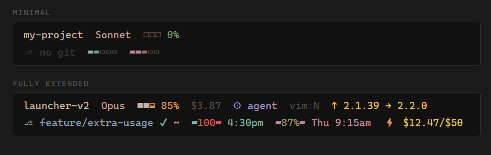

# Claude Tools

Plugin marketplace & standalone tools for [Claude Code](https://docs.anthropic.com/en/docs/claude-code).

**[Browse Plugins](https://gruku.github.io/claude-tools/)** · Marketplace: `gruku-tools`

## Quick Start

```bash
# Add the marketplace
/plugin marketplace add Gruku/claude-tools

# Install a plugin
/plugin install taskmaster@gruku-tools
```

---

## Plugins

### Taskmaster `v1.4.1`

Universal AI-powered task and backlog management. Drop into any project.

- **23 MCP tools** — tasks, epics, phases, dependencies, search, validation, session locking
- **Kanban viewer** — dark/light theme board on port 6800 with filtering, search, and phase progress
- **Session tracking** — auto-generated Done/Decisions/Issues changelog entries
- **Worktree isolation** — every task gets its own git worktree
- **Quality gates** — spec/plan check, code review, tests, build verification
- **TODO auditing** — scan codebase for TODO/FIXME/HACK, cross-reference with backlog
- **Phases** — sequential blocks of work for focus, one active at a time
- **Configurable storage** — `.claude/` (hidden) or project root (git-tracked)

**Skills:** `/init-taskmaster` `/start-session` `/pick-task` `/review-gate` `/end-session` `/check-todos`

### Guard Hooks `v2.1.0`

Safety guard hooks that block destructive CLI commands and sensitive file edits, with in-flow user approval.

- **Destructive command blocking** — prevents `rm -rf`, `git push --force`, `git reset --hard`, etc.
- **Sensitive file protection** — guards `.env`, credentials, and config files from accidental edits
- **User approval flow** — prompts for confirmation via `UserPromptSubmit` before allowing risky actions

**Requires:** jq

**Skills:** `/guard-hooks:install`

---

## Standalone Tools

### Statusline

Pastel statusline for Claude Code with rate limit bars, git status, context usage, update notifications, and session cost tracking.

**[Live Preview](https://gruku.github.io/claude-tools/statusline/)** · Supports Bash and PowerShell



#### Installation

##### macOS / Linux (Bash)

**Requires:** `jq`, `git`

1. Copy the script:
   ```bash
   curl -o ~/.claude/statusline.sh https://raw.githubusercontent.com/Gruku/claude-tools/master/statusline/statusline.sh
   chmod +x ~/.claude/statusline.sh
   ```

2. Add to `~/.claude/settings.json`:
   ```json
   {
     "statusLine": {
       "command": "~/.claude/statusline.sh"
     }
   }
   ```

3. Restart Claude Code.

##### Windows (PowerShell)

1. Copy the script:
   ```powershell
   Invoke-WebRequest -Uri "https://raw.githubusercontent.com/Gruku/claude-tools/master/statusline/statusline.ps1" -OutFile "$env:USERPROFILE\.claude\statusline.ps1"
   ```

2. Add to `~/.claude/settings.json` (located at `%USERPROFILE%\.claude\settings.json`):
   ```json
   {
     "statusLine": {
       "command": "powershell -NoProfile -File \"%USERPROFILE%\\.claude\\statusline.ps1\""
     }
   }
   ```

3. Restart Claude Code.

#### Troubleshooting

**Raw escape codes visible** (e.g. `\033[0;33m` printed literally)

This means something between the script and your terminal is re-encoding the ANSI escape bytes. The statusline scripts output real ESC bytes — they don't rely on the shell to interpret `\033` literals.

- **Don't paste the output into `PS1`/`PROMPT` manually.** The `statusLine.command` setting handles rendering — you just point it at the script.
- **tmux / screen users:** ensure your multiplexer isn't stripping escape sequences. Try `set -g default-terminal "xterm-256color"` in `.tmux.conf`.
- **Check your terminal emulator** supports 24-bit (truecolor) ANSI. Most modern terminals do (iTerm2, Windows Terminal, Ghostty, Alacritty, Kitty, WezTerm). The macOS default Terminal.app has limited truecolor support.

**"statusline: jq required" error (macOS/Linux)**

Install jq: `brew install jq` (macOS) or `sudo apt install jq` (Debian/Ubuntu).

**No rate limit bars showing**

Rate limits are read from stdin JSON — requires Claude Code v2.1.80 or later. Run `claude --version` to check. Bars also only appear when usage is above display thresholds (80%+ for 5h, 80%+ for 7d) or on the first render of a new session.

---

## Marketplace Reference

### Structure

```
claude-tools/
├── .claude-plugin/
│   └── marketplace.json        # plugin catalog
├── plugins/
│   ├── taskmaster/             # AI task management
│   └── guard-hooks/            # safety guard hooks
└── statusline/                 # standalone tool (not a plugin)
```

### Commands

| Command | Purpose |
|---------|---------|
| `/plugin marketplace add Gruku/claude-tools` | Add this marketplace |
| `/plugin install name@gruku-tools` | Install a plugin |
| `/plugin marketplace update gruku-tools` | Pull latest changes |
| `/plugin update name@gruku-tools` | Update a specific plugin |
| `/reload-plugins` | Apply changes without restarting |

### Creating Your Own Plugin

1. Create `plugins/my-plugin/.claude-plugin/plugin.json` with name, description, version, author
2. Add skills in `plugins/my-plugin/skills/<name>/SKILL.md`
3. Add entry to `.claude-plugin/marketplace.json`
4. Push to GitHub — users install via `/plugin marketplace add your/repo`

See [Plugin Marketplaces docs](https://code.claude.com/docs/en/plugin-marketplaces) for the full guide.
