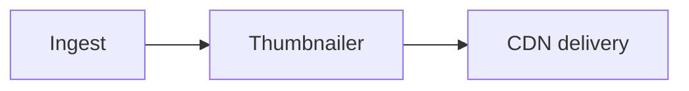

# Task & Epic Protocol — Enforced Pipeline, Merge Ladder, and Living Epics

**Date:** 2026-05-27
**Status:** Approved (design) — decomposes into three implementation specs (A, B, C); build order **C → A → B**
**Related specs:**
- [2026-05-21 Review-Gate-Before-Merge](2026-05-21-review-gate-before-merge-design.md) — becomes Spec B (merge ladder), updated here
- [2026-05-15 Progressive Disclosure](2026-05-15-taskmaster-progressive-disclosure-design.md) — slim/heavy two-tier storage, `tldr` glance pattern, typed links
- [2026-05-19 Project Structure Visibility](2026-05-19-project-structure-visibility-design.md) — `project.yaml` ship_order / structure
**Depends on:** `project.yaml` manifest (`backlog_project_ship_order`) for the merge ladder rungs (Spec B only)

---

## Background

Taskmaster tracks task progress with a single coarse field — `status` ∈ {todo, in-progress, in-review, done, archived, blocked}. That is the only progress signal, and it has three problems the user wants fixed:

1. **No enforced per-task rigor.** A rich pipeline (`PICK → SPEC_REVIEW → WRITE_TESTS → IMPLEMENT → TEST → REVIEW_GATE → HANDOVER_STUB → END_SESSION`) exists *only* in auto-mode, and even there the ordering is enforced by the skill following steps, not by the data layer — `backlog_auto_advance` will set any stage. Manual task work has no pipeline at all. `spec_review` is recorded but advisory; nothing blocks picking or completing a task whose spec review failed. `update_task(field="status")` is a wide-open escape hatch that accepts `todo → done` directly.

2. **No git-landing visibility.** A task carries `branch` and `worktree` strings and nothing else. There is no record of whether the branch merged, into which environment, or how far up a promotion ladder (develop → stage → master) it has travelled. The user explicitly distinguishes "merged into stage" from "merged into a branch" — i.e. they think in terms of a *ladder*, and the data model can't express it.

3. **Epics are invisible at the level that matters.** Epics are metadata-only entries in `backlog.yaml`. They have a `docs` path-pointer dict but **no body file**, so there is nowhere for a design narrative or an architecture diagram to live. Phases can't even hold `docs`. The user reports getting lost in large epics (the CodeMaestro **Asset Engine** is the canonical case): they cannot see the full picture, how locked the design is, or where work stands without drilling into every task.

The user has compute budget to spend on rigor now, so the bar is: **make the pipeline real and enforced for both manual and autonomous work, give tasks a promotion ladder, and turn epics into a living command center where completing a task visibly advances the architecture diagram.**

## Core model: status splits into two layers

`status` stays as the **coarse, human-facing** lifecycle. Underneath it lives a **fine-grained, enforced pipeline** of gates. They reconcile like this:

```
status:   todo ──pick──▶ in-progress ───────────────────────▶ in-review ──user──▶ done
                          └ pipeline (lane-determined):                  │
                            spec→spec-review→plan→plan-review            │
                                 →tests→impl→review-gate ────────────────┘
                                                          merge ladder continues AFTER done
                                                          done✓ · develop✓ · stage✓ · master○
```

- `in-review` is reached when the **review-gate** verdict is `pass` (Claude is done; the user verifies).
- `done` is the user's confirmation. **Enforced:** a task cannot reach `done` unless every *required* gate for its lane is `pass` or explicitly `skipped`.
- The **merge ladder** tracks landing and continues *after* `done`: a task can be `done` and merged to `stage` but not yet `master`. "Shipped" = reached the terminal `ship_order` rung.

One pipeline, one source of truth, enforced at the data layer — so manual work and auto-mode walk the identical gates. Auto-mode stops being a parallel ladder; it becomes the agent that walks this pipeline. (See "Auto-mode convergence.")

## Goals

- Per-task pipeline of gates, **tiered by lane**, with the *required* gates **enforced by the MCP layer** (illegal transitions rejected) and a **recorded-override** escape hatch (`skip_gate(reason)`), surfaced loudly on the dashboard.
- Generalize the advisory `spec_review` record into a uniform **per-gate record** shape covering spec-review, plan-review, and review-gate.
- **Close** the `update_task(status=…)` escape hatch so it routes through the same guards; `skip_gate` becomes the only bypass.
- A **merge ladder** per task, rungs ordered by `project.yaml` `ship_order`, each rung stamped with merge commit + timestamp; auto-recorded by a hook, manually stampable.
- **Epics and Phases become first-class, doc-bearing entities** with their own body file (design narrative + inline diagram), mirroring task two-tier storage.
- **Live components:** an epic declares named components (diagram nodes); each task binds to one via a `component` field; component status is the rollup of its tasks; the diagram auto-colors by component rollup, so completing a task visibly advances the picture.
- **Design-maturity lock** on epics (`exploring → proposed → locked → revising`) with light teeth: redesigning a locked epic requires a recorded decision.
- **Derived rollups + risk surface** on epics: status counts, gate-completion, merge-ladder rollup, and bubbled-up stuck items (failed gates, blocked tasks, open decisions) — all computed, no manual bookkeeping.

## Non-goals

- Replacing the `taskmaster:review-gate` or `taskmaster:spec-review` skills. This protocol adds a *recording* and *enforcement* layer; the skills still do the actual reviewing.
- Re-running gates from hooks. The merge-gate hook checks for a recorded pass; it does not invoke the skill.
- PR-level / remote-branch gating. The merge ladder is local-`git merge` only (same boundary as Spec B). Remote protections are the platform's job.
- Auto-classifying branch type (docs/hotfix/revert). Lane is inferred from `kind` and overridable; merge exemptions are explicit (`skip_merge_gate`).
- Configurable per-knob pipelines beyond the three lanes. Lanes are the opinionated default; per-gate `skip_gate` covers the exceptions. (Per the project's "opinionated defaults, not toggles" philosophy.)

---

## Pillar 1 — Lanes & enforced gates (Spec A)

### Lane

`lane` is a new task field, **inferred from `kind`** at creation, overridable via `backlog_update_task(id, "lane", …)`. It selects which gates are *required* — and required = what the MCP layer refuses to let you skip silently.

| Lane | Required pipeline | Inferred from `kind` |
|---|---|---|
| **full** | spec → spec-review → plan → plan-review → tests → impl → review-gate → merge | `feature` (default when `kind` absent) |
| **standard** | spec(+plan merged) → design-review → tests → impl → review-gate → merge | `fix`, small change |
| **express** | impl → review-gate → merge | `chore`, `docs`, `refactor-pure`, hotfix |

The lane → required-gate-set mapping is an opinionated default baked into the loader. A project *may* tune it under `project.yaml` `meta.policies.lanes` later, but that is deferred — start with the code default (YAGNI).

### Gate record

Today's `spec_review` dict (`{verdict, timestamp, codex_used, critical_count, important_count, spec_path}`) generalizes into a uniform per-gate record under a `gates` map on the task. Two record kinds:

```yaml
gates:
  # artifact / work gates — existence + timestamp
  spec:        { status: done, at: 2026-05-27T10:00Z }
  plan:        { status: done, at: 2026-05-27T10:30Z }
  tests:       { status: done, at: 2026-05-27T11:00Z, commit_sha: aaa111 }
  impl:        { status: done, at: 2026-05-27T12:00Z }
  # review gates — verdict + review metadata (the generalized spec_review shape)
  spec-review:  { verdict: pass, at: …, codex_used: true, critical_count: 0, important_count: 1, doc: specs/… }
  plan-review:  { verdict: pass, at: …, critical_count: 0, important_count: 0 }
  review-gate:  { verdict: pass, at: …, commit_sha: bbb222, critical_count: 0 }
```

A **skipped** gate carries the override paper trail:

```yaml
  plan-review: { skipped: true, reason: "trivial config change", at: …, by: claude|user }
```

`verdict` ∈ {pass, warn, fail}; `status` ∈ {pending, done}. Storage follows the two-tier convention: a compact glance mirror in the slim tier (`lane`, plus a one-line `gate_state` such as `"review-gate:pass"` or `"blocked@plan-review"`), the full `gates` map in the heavy tier (task `.md` frontmatter). Exact slim-mirror fields are pinned in the Spec A implementation plan.

### Enforcement rules (MCP / data layer)

The guards live where mutations happen (the `backlog_*` write path), extending the existing `14520c7` lifecycle guard:

1. **`complete_task` (→ done):** already rejects `todo → done`. Extend to require *every* required gate for the task's lane to be `verdict: pass` (review gates) / `status: done` (artifact gates) / `skipped`. Otherwise reject with the list of outstanding gates.
2. **Advancing a stage / recording a gate out of order:** recording a gate as done/pass is rejected if an *earlier* required gate is neither pass nor skipped. (No reaching `review-gate` while `spec-review` is `fail`.)
3. **`update_task(field="status")` — close the escape hatch.** Route status writes through the same checks as `complete_task`. Raw arbitrary status edits are no longer accepted. (Confirmed opinionated call: the only bypass is `skip_gate`.)
4. **`skip_gate(task_id, gate, reason)` — the sole recorded override.** Writes `{skipped: true, reason, by, at}` to the gate. Always succeeds (that's the point of an escape hatch), and is **flagged red on the dashboard** so every bypass is visible. No silent skips anywhere.

New / changed MCP surface (names indicative; pinned in plan):
- `backlog_record_gate(task_id, gate, verdict|status, **meta)` — generalizes `backlog_set_spec_review` (which becomes a thin alias). Enforces ordering rule 2.
- `backlog_skip_gate(task_id, gate, reason)` — rule 4.
- `backlog_clear_gate(task_id, gate)` — generalizes `backlog_clear_spec_review`.
- `backlog_task_pipeline(task_id)` — read the lane, required gates, and current gate states for display.
- `complete_task` / `update_task` guards extended (rules 1, 3).

### Auto-mode convergence

The auto state machine (`AUTO_STAGES`) currently hard-codes one sequence. It becomes **lane-aware**: it walks exactly the required gates for the task's lane (full adds PLAN + PLAN_REVIEW stages; express skips SPEC/PLAN), and each `backlog_auto_advance` records the corresponding gate via `backlog_record_gate` — so the auto cursor and the enforced pipeline are the same object, not two parallel ladders. Manual = the human walks the gates; auto = the agent walks them; identical enforcement either way. This is where the compute budget goes: the full lane's extra plan-review and review-gate passes become affordable agent work.

---

## Pillar 2a — Merge ladder (Spec B)

This is the [2026-05-21 Review-Gate-Before-Merge](2026-05-21-review-gate-before-merge-design.md) design, adopted with two adjustments:

1. **Rung ordering from `ship_order`.** The 2026-05-21 spec models targets as a flat label→branch map (`meta.policies.merge_targets`). Keep that branch mapping, but order the rungs by the project manifest's **`ship_order`** (`backlog_project_ship_order`), so the ladder renders as an ordered promotion path (e.g. `develop → stage → master`). A single-`master` repo gets a one-rung ladder.
2. **Key off the generalized gate.** The merge-gate hook reads the task's `gates["review-gate"].verdict` (Pillar 1) rather than a standalone `review_gate` block. The `merge_status` frontmatter shape is unchanged.

Per task:

```yaml
merge_status:
  develop: { merged_at: 2026-05-24T…, merge_commit: a1b2c3d }
  stage:   { merged_at: 2026-05-26T…, merge_commit: e4f5g6h }
  master:  null     # not yet
skip_merge_gate: false
merge_gate_freshness: strict   # strict (gate commit must equal branch tip) | any
```

Mechanism (unchanged from 2026-05-21):
- **PreToolUse `merge-gate.sh`** blocks `git merge <task-branch>` into a ship_order rung unless `review-gate` is `pass` (and fresh, per `merge_gate_freshness`). Fail-open on any uncertainty; one-shot Approve/Deny on block.
- **PostToolUse `merge-recorder.sh`** stamps the rung from the merge commit. `backlog_record_merge(task_id, rung, sha)` is the manual fallback.

Phasing is inherited: the recording layer (tools + frontmatter + viewer ladder) ships independently; the enforcement hooks depend on `project.yaml` (`project-manifest-001`). Because Pillar 1 generalizes the gate record, Spec B's `backlog_record_review_gate` is subsumed by `backlog_record_gate(task_id, "review-gate", …)`.

---

## Pillar 2b — Living Epics & Phases (Spec C, built first)

The structural centerpiece and the direct fix for "I get lost in the Asset Engine." Built **first** because defining the epic picture reveals exactly what tasks must hook into (the `component` binding), which then informs Spec A's task model.

### Body files

Epics and Phases get their own markdown files — `epics/<id>.md` and `phases/<id>.md` — mirroring `tasks/<id>.md`'s two-tier storage: slim metadata stays in `backlog.yaml`; the heavy tier (design narrative, `docs` path-pointers, the diagram, the components block) lives in the `.md` frontmatter + body. This is the real answer to "can epics store docs like tasks?" — today they hold only path-pointers; now they get a body. The `resolve_sections` / slim-heavy machinery is extended from tasks to these two entity types.

### Components make the diagram live

The epic frontmatter declares named **components** — the boxes of "what we're building" — each tied to a node id in the body's Mermaid diagram:

```yaml
# epics/asset-engine.md (frontmatter)
components:
  ingest: { node: A, title: "Ingest" }
  thumb:  { node: B, title: "Thumbnailer" }
  cdn:    { node: C, title: "CDN delivery" }
design_status: locked
docs: { design: specs/asset-engine.md }
```



Each task carries a new `component` field (`backlog_update_task(id, "component", "thumb")`). A component's status is the **rollup of its tasks**, and the diagram auto-colors each node by that rollup at render time — so completing a task lights up its node. Progress is "baked into the task," exactly as specified: no manual epic bookkeeping; you watch the build advance *through the diagram*.

```
A[Ingest] █ done (3/3)  →  B[Thumbnailer] ▨ wip (1/2)  →  C[CDN] □ todo (0/2)
```

Components are stable scaffolding: tasks churn underneath without breaking node bindings (the binding is to the component key, not the Mermaid syntax). A task with no `component` rolls up to an implicit "unassigned" bucket shown separately.

### Design-maturity lock

Epic slim field `design_status` ∈ {exploring, proposed, locked, revising}. When **locked**, a task flagged as design-changing under that epic requires a recorded `backlog_decision` to reopen — which flips the epic to `revising`. Light teeth: it doesn't block implementation tasks, only design churn, and it answers "how locked is the design actually." How a task signals "design-change" (an explicit flag vs. editing the epic's `docs.design` while locked) is pinned in the Spec C plan; default proposal: editing a locked epic's design doc, or creating a task tagged `design-change`, triggers the decision requirement.

### Derived rollups + risk surface

Both computed from child tasks — zero bookkeeping:

- **Progress rollup:** status counts, gate-completion (`spec-review 5/7`, `review-gate 4/7`), merge-ladder rollup (`develop 5 · stage 3 · master 3`), and a "% landed to terminal rung" bar. (Gate-completion is coarse until Spec A lands, then richens automatically.)
- **Risk surface:** failed gates, blocked tasks, and open decisions linked to the epic bubble up into a single attention list, so stuck items are visible without drilling into each task.

`backlog_phase_status` / a new `backlog_epic_status` expose these for the viewer and for glance reads.

---

## Viewer surface

- **Epic detail screen (new):** the colored Mermaid diagram (nodes styled by component rollup via injected `classDef`), the component list, the progress rollup, the risk/attention list, the `design_status` lock badge, and the design narrative/docs.
- **Task detail:** the gate pipeline tracker (gate ladder with pass/fail/skip badges; skips flagged red) and the merge ladder (`co | st | pr`-style dots, ordered by `ship_order`).
- **Kanban cards:** lane badge, `gate_state` one-liner, merge-rung dots.

Visual rules (per `CLAUDE.md`, hard): no colored left rails on cards; no hover motion (color/border/background only); no box-shadows for elevation (surface stepping). Node coloring uses tinted fills, not left accents.

---

## Decomposition & sequencing

Too large for one implementation plan. Three specs:

| Spec | Scope | Depends on |
|---|---|---|
| **C — Living Epics** | epic/phase body files; components + `component` task field; diagram coloring; `design_status` lock; derived rollup + risk surface; viewer epic screen | — (rollup rides on existing coarse status initially) |
| **A — Gates foundation** | lane model; generalized gate records; ordering + completion + escape-hatch guards; `skip_gate`; skill updates; auto-mode convergence | C (knows the `component` hook); reuses existing `spec_review` |
| **B — Merge ladder** | adopt 2026-05-21 spec; `ship_order` rung ordering; key off `review-gate` gate; recording layer + hooks | A (review-gate verdict), `project.yaml` (hooks/Phase B) |

**Build order: C → A → B.** C first because the epic/component shape defines what tasks hook into; A then builds the gate pipeline with the `component` binding already known; B is the bolt-on that gates and records merges. C's rollup uses coarse status until A lands, then enriches automatically.

## Testing approach

- **C:** epic/phase body-file round-trip (slim/heavy split, atomic write, `sort_keys=False`); component-rollup computation from task fixtures; diagram-coloring injection; `design_status` lock → decision-required path; rollup/risk derivation; viewer unit tests for the epic screen.
- **A:** lane inference from `kind`; gate-record round-trip; each enforcement rule (complete_task gate-completeness, out-of-order rejection, closed status hatch, skip_gate override) as a unit test; auto-mode lane-aware advance recording the right gates.
- **B:** inherits the 2026-05-21 test plan (hook decision-table matrix, temp-repo integration, fail-open cases, Approve bypass), plus `ship_order` rung-ordering tests.

## Open questions (deferred, not blocking)

- **Design-change detection** for the lock (explicit task flag vs. editing locked `docs.design`) — pick one in the Spec C plan.
- **Slim-mirror fields** for gate glance reads — exact set pinned in Spec A plan.
- **Lane policy override** in `project.yaml` (`meta.policies.lanes`) — deferred until a project actually needs to retune the defaults.
- **Phase-level components/diagram:** phases get body files + docs now; whether phases also get the component/diagram treatment (vs. epics only) is deferred — start with epics, extend if the phase view demands it.
- **Component for cross-cutting tasks** that touch several components — v1 binds a task to a single `component`; multi-bind is deferred.
